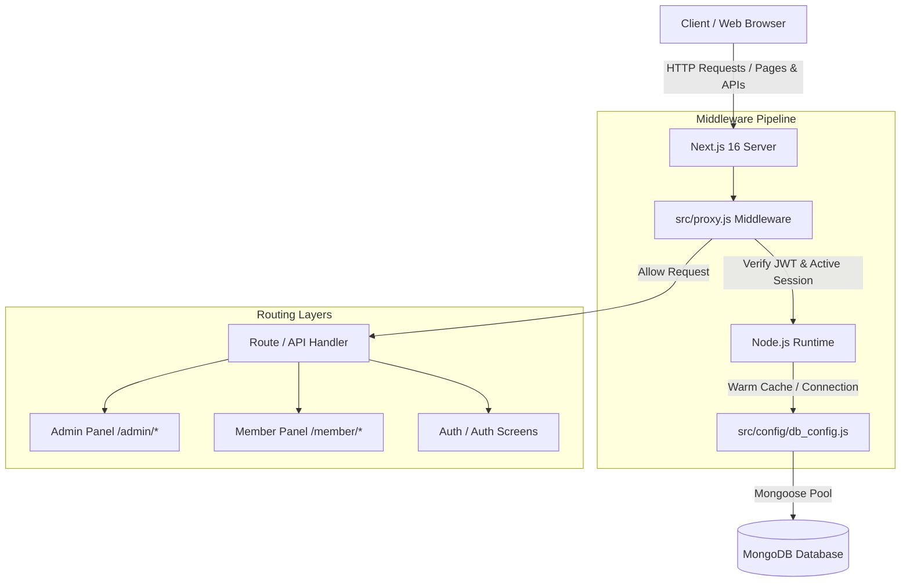
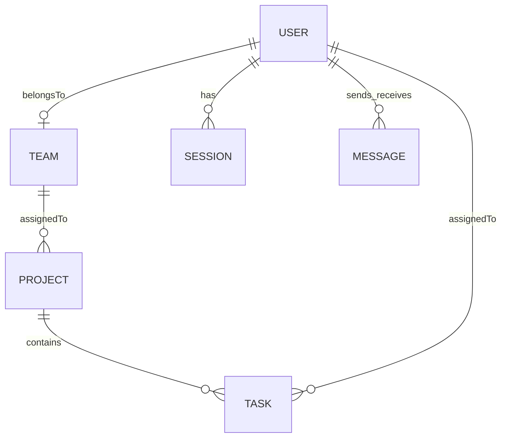

# Ethara AI — Technical Architecture & Data Flow

This document provides a deep dive into the underlying architecture, data models, authentication mechanisms, and workflows that power the **Ethara AI** Project and Task Management System.

---

## 🏗️ Architectural Overview

Ethara AI is designed as a secure, role-based, multi-tenant enterprise system. The core architecture uses:
- **Next.js 16 (App Router)** for unified server-side rendering, client component interactivity, and API Route Handlers.
- **MongoDB & Mongoose** as the primary document database for persistence.
- **Node.js-based Middleware (Proxy)** for page-level access control, session validation, and database connection warming.



---

## 🔒 Next.js 16 Custom Proxy Middleware

A major architectural highlight of Next.js 16 in this project is the deprecation of the older edge-runtime `middleware.js` convention in favor of **`proxy.js`**. 

### Key Characteristics of `proxy.js`
1. **Node.js Runtime by Default**: Unlike the restricted Edge runtime, `proxy.js` runs in a full Node.js environment. This allows us to perform intensive cryptographic computations (via `jsonwebtoken`) and connect directly to MongoDB (`connectionDb()`) during the routing hook itself, before the request ever reaches pages or API routes.
2. **Session and Auth Verification**: In `src/proxy.js`, on every page transition (excluding public assets and APIs), the server:
   - Verifies the `token` cookie (JWT).
   - Establishes a connection to the MongoDB Atlas cluster.
   - Checks the session registry (`Session` model) by referencing the `sessionId` cookie.
   - Automatically updates the `lastActive` timestamp of the current session (debounced to once every 30 seconds).
   - Validates user role access boundaries (e.g., blocking members from `/admin/*` and admins from `/member/*`).

---

## 🗄️ Database Schemas & Relationships

The database layer consists of six core MongoDB schemas, linked via references (`ObjectId`):



### 1. User Schema (`User`)
Represents members and administrators.
- **Access Control**: Users must have `isverified: true` to authenticate. Admins must have both `isAdmin: true` and `role: "admin"`.
- **References**:
  - `teamId`: Points to the user's active `Team` (optional for admins).

### 2. Team Schema (`Team`)
Defines organizational boundaries.
- **Roster**: Contains an array of references to `User` (`members`).
- **Ownership**: Tracks the creator Admin via `createdBy`.

### 3. Project Schema (`Project`)
Scopes and groups specific tasks.
- **Mapping**: Belongs to exactly one `Team` (`teamId`).
- **Ownership**: Tracks the creator Admin via `createdBy`.

### 4. Task Schema (`Task`)
Represents granular units of work.
- **Lifecycle**: Status can transition between `todo`, `in-progress`, and `done`. Priority scales between `Low`, `Medium`, and `High`.
- **References**:
  - `assignedTo`: Reference to the `User` performing the task.
  - `projectId`: Reference to the parent `Project`.
- **Telemetry & Logs**: Contains a subdocument array `updates` logging notes and comments with a timestamp and the user who posted them (`postedBy`).

### 5. Session Schema (`Session`)
Maintains active device logins.
- **Session Limits**: Enforces a strict maximum of **5 concurrent active sessions** per user. If a user logs in on a 6th device, the oldest session is automatically deleted from the database.
- **User Agent Parsing**: Extracts `device` type (Desktop, Mobile, Tablet) and `browser` engine from client request headers on login.

### 6. Message Schema (`Message`)
Enables direct peer-to-peer collaboration.
- **Tracking**: Logs `sender` and `receiver` `ObjectId`s, message `content`, and read receipt (`isRead`).

---

## 🔄 Core Workflow Operations

### 🔑 The Dual-Cookie Authentication Flow
Ethara AI uses a secure token rotation mechanism based on HttpOnly, SameSite=strict cookies to prevent CSRF and XSS attacks:

```
[User Login] 
     │
     ▼
[Verify Credentials (bcrypt)]
     │
     ▼
[Generate Dual Tokens] 
 ├── Access Token (token) ─── Expires in 1 Day (JWT)
 └── Refresh Token (refreshToken) ─── Expires in 5 Days (JWT)
     │
     ▼
[Create Database Session (SessionModel)] 
     │
     ▼
[Send HttpOnly Cookies to Client]
 ├── Cookies: token, refreshToken, sessionId
 └── Redirect based on Role:
      ├── role = "admin"  ──> /admin/dashboard
      └── role = "member" ──> /member/dashboard
```

### 👥 Bulk Team Task Assignment Workflow
To simplify management, administrators can assign a single task to an *entire team* in one action.
1. The admin fills out the task form, selects a Project, ticks "Assign to Team", and submits.
2. The payload sends the task information along with an array of member IDs.
3. The backend API (`POST /api/tasks`) loops through the member IDs and generates a distinct, individual `Task` document for each member in a parallel batch (`Promise.all`).
4. Each member receives their own independent copy of the task on their Kanban board, allowing individual progress tracking while remaining linked to the same Project.

### 💬 Live Messaging Flow
Team collaboration is powered by a poll-based/direct routing setup:
1. Team members click **Message** on a teammate's profile inside the "My Team" directory.
2. The user is redirected to the `/member/messages` panel, automatically selecting the recipient.
3. The messaging UI initializes a history pull from `GET /api/messages?receiverId=<recipient_id>`.
4. Messages posted are dispatched to `POST /api/messages` and immediately saved to MongoDB, keeping discussions persistent and audit-compliant.
